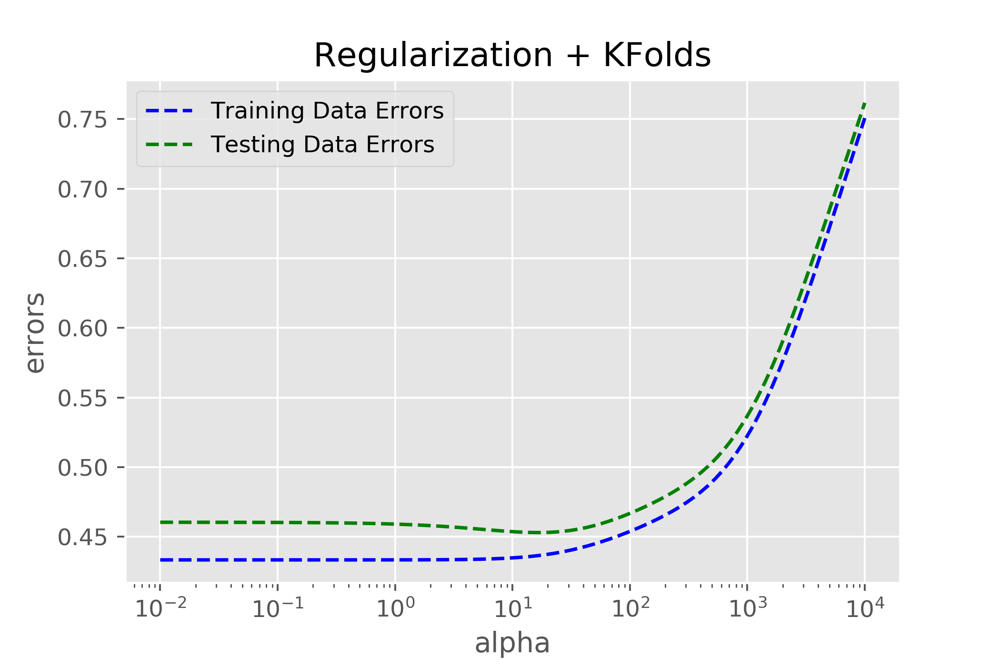

# Forecasting-HIV-Infections Case Study

## Case Study Goal
1)	To accurately model HIV incidences (new infections per 100,000) in US 
counties by building a linear regression model that utilizes HIV infection data,
census data, data on the opioid crisis, and data on sexual orientation.

2)	Identify features that are the most significant drivers of HIV infection 
rates and learn how these drivers differ between different regions.

## Team
Maureen, Joe, Cindy, Richard

## Table of Contents
[Background](#Background)

[Findings](#Findings)

[Tables](#Tables)
## Background
Due to the development of anti-retroviral therapies the HIV/AIDS epidemic is 
generally considered to be under control in the US.  However, as of 2015 there 
were 971,524 people living with diagnosed HIV in the US with an estimation of 
37,600 new HIV diagnoses in 2014.  HIV infection rates continue to be particularly
problematic in communities of color, among men who have sex with men (MSM), the
transgender community, and other vulnerable populations in the US. Socioeconomic 
factors are a significant risk factor for HIV infection and likely contribute 
to HIV infection risk in these communities.  The current US opioid crisis has 
further complicated the efforts to combat HIV with HIV infection outbreaks now 
hitting regions that weren’t previously thought to be vulnerable to such outbreaks.  

A model that can accurately forecast regional HIV infection rates would be 
beneficial to local public health officials.  Provided with this information, 
these officials will be able to better marshal the resources necessary to combat
HIV and prevent outbreaks from occurring.  Accurate modeling will also identify 
risk factors for communities with high HIV infection rates and provide clues 
as to how officials may better combat HIV in their respective communities.

## Models
We used the following regression models:
- Linear Regression (both stats models and sklearn)
- K-Fold Linear Regression
- Regularization with K-Fold
The residuals from the regression model are shown below. Note the outlier due to one of the counties having an extremely high incidence of HIV.

The metric we used to quantify our model was root mean squared error, although this value would fluctuate depending on the train/test split. The outlier with an incidence of 717 seemed to add greatly to the test errors. Below are the values we got for the different methods.
- stats.models Linear Regression: 9.35
- sklean Linear Regression: 9.35
- Regularization + KFold: 1.75
The regularizaion parameter alpha was chosen as the parameter for which the test errors were the smallest. The plot below shows the variation in train and test errors as alpha is changed and alpha = 2 corresponds to the minimum test errors.

## Findings

